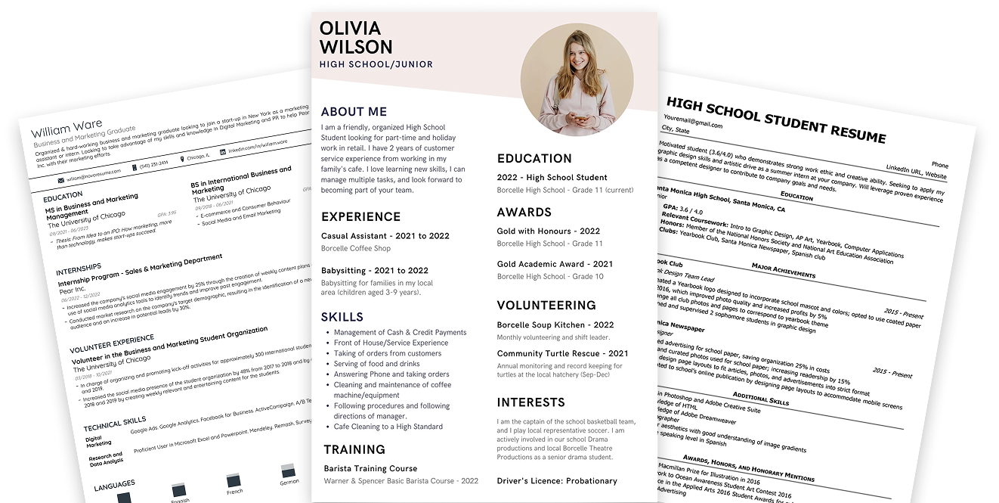

# CVGenie 🚀

<div align="center">
  
  <h1>Create stunning resumes in minutes with AI-powered assistance! ✨</h1>
  <p><strong>Transform your career story into a masterpiece</strong></p>
</div>

<div align="center">
  
  
  
  
  
  
</div>

---

## 🌟 What is CVGenie?

CVGenie is a cutting-edge, AI-powered resume builder that revolutionizes the way you create professional resumes. Built with modern web technologies, it offers an intuitive interface, multiple templates, and real-time preview to help you craft compelling resumes that stand out.

<div align="center">
  
</div>

## ✨ Key Features

<table>
  <tr>
    <td align="center">
      <br/>
      <strong>AI-Powered Generation</strong><br/>
      Smart suggestions and content optimization
    </td>
    <td align="center">
      <br/>
      <strong>Professional Templates</strong><br/>
      Multiple designs for every career level
    </td>
    <td align="center">
      <br/>
      <strong>Real-time Preview</strong><br/>
      See changes instantly as you type
    </td>
  </tr>
  <tr>
    <td align="center">
      <br/>
      <strong>PDF Export</strong><br/>
      High-quality downloads ready for submission
    </td>
    <td align="center">
      <br/>
      <strong>Secure Authentication</strong><br/>
      Google OAuth for safe account management
    </td>
    <td align="center">
      <br/>
      <strong>Responsive Design</strong><br/>
      Perfect on any device, anywhere
    </td>
  </tr>
</table>

## 🛠️ Tech Stack & Architecture

<div align="center">
  
</div>

- **Frontend**: Next.js 14, React 18, TypeScript
- **Styling**: Tailwind CSS, Custom Components
- **Backend**: Next.js API Routes, Prisma ORM
- **Database**: PostgreSQL
- **Authentication**: NextAuth.js with Google OAuth
- **Fonts**: Geist, League Spartan, Quicksand
- **Deployment**: Vercel with Analytics
- **Version Control**: Git

## 🚀 Quick Start

### Prerequisites
- Node.js 18+
- npm/yarn/pnpm
- PostgreSQL database

### Installation Steps

<div align="center">
  
</div>

1. **Clone the repository**
   ```bash
   git clone https://github.com/codewithevilxd/cv-genie.git
   cd cv-genie
   ```

2. **Install dependencies**
   ```bash
   npm install
   ```

3. **Environment Setup**
   ```bash
   cp .env.example .env.local
   # Edit .env.local with your credentials
   ```

4. **Database Setup**
   ```bash
   npx prisma generate
   npx prisma db push
   ```

5. **Launch Development Server**
   ```bash
   npm run dev
   ```

6. **Open in Browser**
   Visit [http://localhost:3000](http://localhost:3000)

## 📱 Screenshots & Interface

### Landing Page
<div align="center">
  
</div>

### Resume Creation Interface
<div align="center">
  
</div>

### Template Selection
<div align="center">
  
</div>

### Mobile Experience
<div align="center">
  
</div>

## 📋 Usage Guide

1. **Sign Up/In**: Secure authentication with Google
2. **Choose Template**: Select from professional designs
3. **Fill Details**: Add personal info, education, experience
4. **Customize**: Enhance with skills, projects, achievements
5. **Preview**: Real-time visual feedback
6. **Export**: Download as PDF or save online

## 🤝 Contributing

<div align="center">
  
</div>

We love contributions! Here's how you can help:

1. Fork the repository
2. Create your feature branch (`git checkout -b feature/amazing-feature`)
3. Commit changes (`git commit -m 'Add amazing feature'`)
4. Push to branch (`git push origin feature/amazing-feature`)
5. Open a Pull Request

## 📞 Connect With Us

<div align="center">
  
</div>

<div align="center">
  <a href="https://github.com/codewithevilxd">
    
  </a>
  <a href="https://discord.gg/raj.dev_">
    
  </a>
  <a href="https://cvgenie.vercel.app/contact">
    
  </a>
</div>

## 📄 License

<div align="center">
  
</div>

This project is licensed under the MIT License - see the [LICENSE](LICENSE) file for details.

---

<div align="center">
  
  <p><strong>Made with ❤️ by the CVGenie team</strong></p>
  <p>Empowering careers, one resume at a time</p>
</div>
